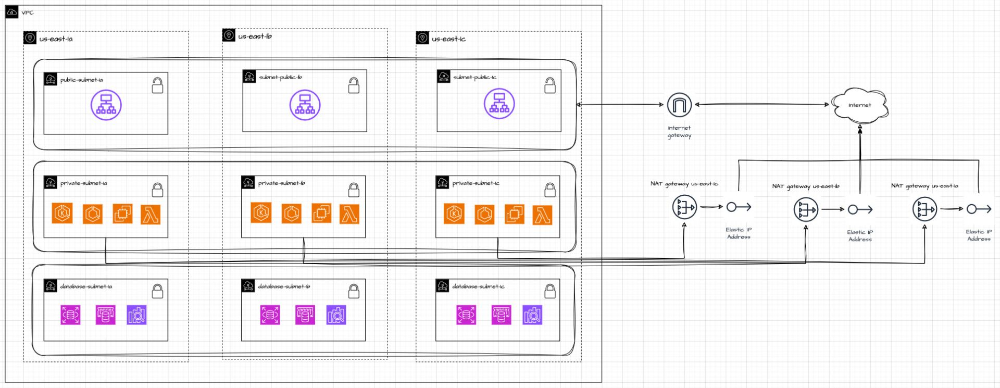
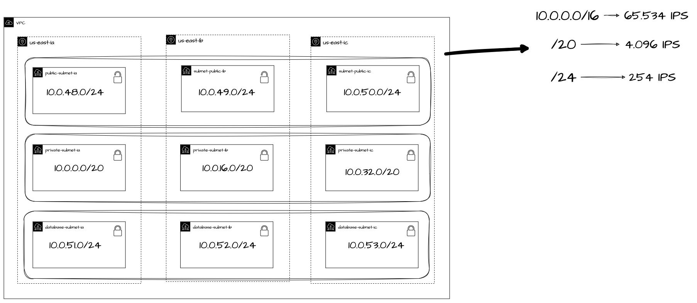

ArquiteturaContainersAWS - Day 1

# ArquiteturaContainersAWS - Day 1
Repositório para o curso de Arquitetura de Containers na AWS da LinuxTips - Instrutor: Matheus Fidelis

Iniciamos fazendo um breve resumo sobre os recursos de VPC da AWS.  A VPC Virtual Private Cloud que é a base para construção de uma infraestrutura de rede isolada na nuvem que permite um controle completo para configurar e gerenciar.

Regiões são áreas geográficas que contém múltiplas AZ's (Zonas de disponibilidade) que atuam independentemente, que facilita trabalhar com tolerância a falhas e estabilidade.

Zonas de Disponibilidade (AZ's) são datacenters com energia, rede e conectividade redundantes que proporcionam alta disponibilidade, tolerância a falhas e escalabilidade em níveis superiores aos que um único datacenter pode oferecer. 

Atualmente a AWS disponibiliza 108 zonas de disponibilidade em 34 regiões geográficas.

VPC é o isolamento de uma rede em relação a outras redes na nuvem, no qual permite o controle de acesso e de tráfego entre as redes. 
Dentro de uma VPC podemos escolher um bloco de IP's que será utilizado.
Criar sub-redes que permite a segmetação e controle de acesso a diferentes partes da sua rede. 
Configuração de tabelas de rotas e gateways que permite a definição do direcionamento do tráfego dentro da VPC e para fora.
Criação de firewalls virtuais que controlam o tráfego de entrada e saída.
E também e possível ter um controle do tráfego entre as sub-redes utilizando as Listas de Controle de Acesso à Rede (NACLs).

 

# Requisitos

| Name | Version |
|------|---------|
|  [Terraform](#terraform\_terraform) | v1.9.4  |
|  [aws-cli](#aws\_cli) | 2.5.8  |

 

O Planejamento é construir um ambiente com três zonas de disponibilidade todas na região us-east-1.
 - Uma VPC
 - Três Sub-Redes: Uma Pública, Uma Privada e Uma para os Databases.
 - Um Internet Gateway
 - Um NAT-Gateway
 - Um Elastic IP

 

O endereçamento foi dividido em:
- VPC 10.0.0.0/16 ---- 65.534 IP's
- Duas sub-redes /24  --------- 4.096 IP's
- Uma sub-rede /20 ---- 254 IP's

   
